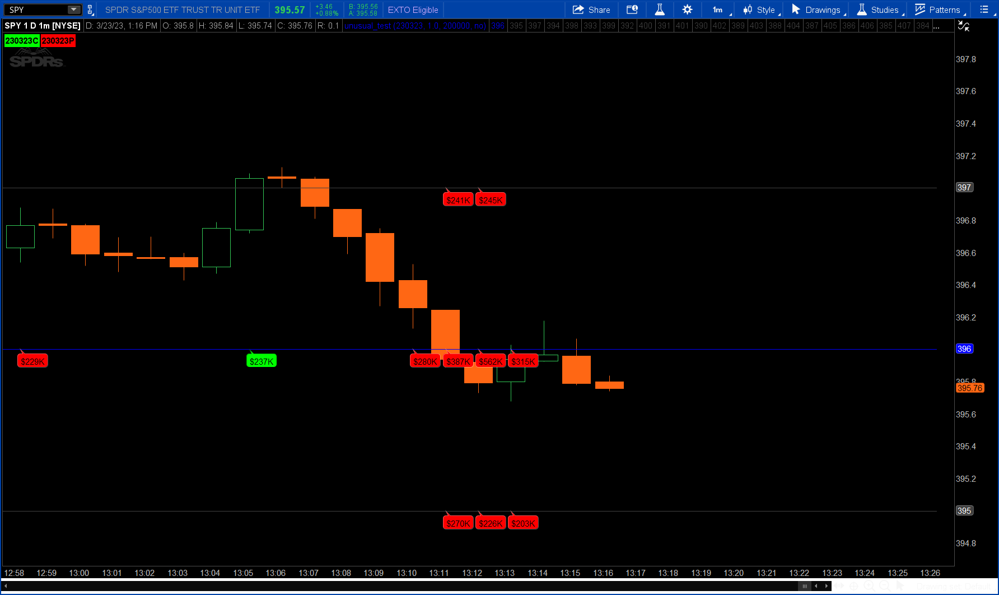

# ThinkScript

<a name="readme-top"></a>

<!-- PROJECT LOGO -->
<br />
<div align="center">
  <a href="https://2187.io">
    
  </a>

  <h1 align="center">Indicators and Strategies</h1>
</div>

<!-- TABLE OF CONTENTS -->
<details>
  <summary>Table of Contents</summary>
  <ol>
    <li>
      <a href="#unusual-options">Unusual Options</a>
       <ul>
         <li><a href="#Equities">Equities</a></li>
         <li><a href="#Futures">Futures</a></li>
         <li><a href="#spy-spx-combo">SPY-SPX Combo</a></li>
          <li><a href="#volume-only">Volume Only</a></li>
      </ul>
    </li>
    <li>
      <a href="#greeks">Greeks</a>
       <ul>
         <li><a href="#gamma">Gamma</a></li>
         <li><a href="#vanna">Vanna</a></li>
         <li><a href="#charm">Charm</a></li>
      </ul>
    </li>
    <li>
      <a href="#open-interest-volume">Open Interest and Option Volume</a>
      <ul>
        <li><a href="#open-interest">Open Interest</a></li>
        <li><a href="#option-volume">Option Volume</a></li>
      </ul>
    </li>
    <li><a href="#contributors">Contributors</a></li>
    <li><a href="#contact">Contact</a></li>
    <li><a href="#acknowledgments">Acknowledgments</a></li>
  </ol>
</details>


<!-- Unusual Options -->
## Unusual Options

### Equities
<a href="https://github.com/2187Nick/thinkscript/blob/main/unusual_options_new/unusual_options_new" target="_blank">
    
</a>

### Futures

### SPY-SPX Combo

### Volume Only


<!-- Greeks -->
## Greeks

### Gamma
    
### Vanna

### Charm
    

<p align="right">(<a href="#readme-top">back to top</a>)</p>


<!-- Open Interest and Option Volume -->
## Open Interest and Option Volume

### Open Interest

### Option Volume


<p align="right">(<a href="#readme-top">back to top</a>)</p>

## Installation

https://github.com/2187Nick/thinkscript/blob/main/Instructions.md

### Clone the repo
   ```sh
   git clone https://github.com/2187Nick/thinkscript.git
   ```


<p align="right">(<a href="#readme-top">back to top</a>)</p>

<!-- CONTRIBUTORS -->
## Contributors

Any contributions you make are **greatly appreciated**.

If you have a suggestion that would make this better, please fork the repo and create a pull request.
You can also join discord to give ideas and feedback.
Don't forget to give the project a star! Thanks again!

1. Fork the Project
2. Create your Feature Branch (`git checkout -b feature/AmazingFeature`)
3. Commit your Changes (`git commit -m 'Add some AmazingFeature'`)
4. Push to the Branch (`git push origin feature/AmazingFeature`)
5. Open a Pull Request

<p align="right">(<a href="#readme-top">back to top</a>)</p>


<!-- CONTACT -->
## Contact

  [@2187Nick](https://twitter.com/2187Nick) - nick@2187.io

  [https://github.com/2187Nick](https://github.com/2187Nick)

<p align="right">(<a href="#readme-top">back to top</a>)</p>


<!-- ACKNOWLEDGMENTS -->
## Acknowledgments

Notable Resources:


<p align="right">(<a href="#readme-top">back to top</a>)</p>

