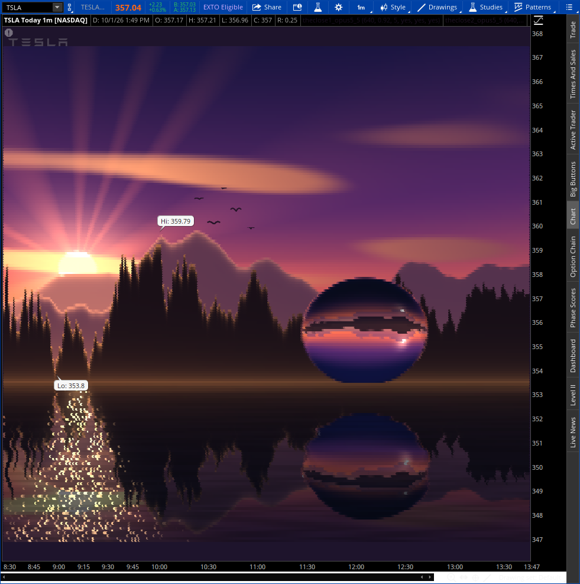

# THE CLOSE — Opus 5.5

*A per-pixel ray tracer written in thinkScript.* Oct 1, 2026

*Live in thinkorswim: TSLA, today, 1m.*

Every earlier piece in this gallery is vector art: flat-colored `AddCloud`
polygons and fixed-color lines. THE CLOSE treats the chart as a **framebuffer**.
Each of its 200 scanlines is a plot whose color is computed **for every bar**
with `CreateColor(r, g, b)`. The result is smooth lighting, glow, and refraction
that flat fills can't produce.

What is computed per pixel:

- **Sky**: altitude gradient, three-lobe sun glow, crepuscular rays, and cloud
  streaks lit from below by the low sun.
- **Mountains**: three ranges with aerial perspective (fog by depth and
  altitude), valley mist, and sun-facing rim light. Edges are anti-aliased.
- **Lake**: Fresnel reflection of the whole scene with per-row ripple
  displacement, a sun path, glitter, and wind streaks.
- **Lensball**: exact ray–sphere intersection, Snell refraction in and out of
  glass (n = 1.5), Fresnel reflection, and an environment lookup. You see the
  whole sunset upside down inside it, and the lake reflects the ball by
  ray-tracing its mirror image.

**The market is the subject.** The nearest ridgeline (the pine forest) *is* the
chart's own closing prices. In the screenshot above, the "Hi: 359.79" and
"Lo: 353.8" bubbles sit right on the treeline. The range behind it is their
34-bar EMA. The sun searches the skyline and **sets into its deepest notch**.
Rays, glitter, and the inverted sun inside the ball all follow it. Every ticker
and every day produces a different sunset.

## Previews

Rendered offline by parsing the actual study files with the interpreter in `src/`.

| TSLA, ~830×900 chart | SPY: different data, different sunset |
| --- | --- |
|  |  |

**Wide chart (`aspectRatio = 1.78`)**

## Install

1. Create four studies (for example `theclose1_opus5_5` … `theclose4_opus5_5`),
   pasting [`part1`](part1) … [`part4`](part4). Add all four to the same chart.
2. Use a **1D 1m** chart (600–1000 bars). Turn on "Fit studies" and use no
   right expansion.
3. Set `aspectRatio` = chart width / height in pixels so the ball stays round.
   The default 0.92 fits an ~830×900 plot area; use 1.78 for a wide chart.

Each part draws every 4th scanline. Any subset still shows the whole picture,
just at lower resolution. Part 1 owns the background, the candle hiding, and
the caption. Each part is about 50 KB and does roughly 40k operations per bar,
so expect a few seconds to draw.

## How it was built

`src/` contains a small compiler. `dsl.py` builds a hash-consed expression DAG
with constant folding and cost-aware common-subexpression elimination, then
emits thinkScript `script` subroutines (`TcLand`, `TcLake`, `TcLensBall`,
`TcMix`). The same DAG is evaluated with numpy for previews. `scene.py` holds
the shading and `emit.py` writes the four parts.

`tsinterp.py` is an independent mini thinkScript interpreter. It parses the
emitted text and re-renders it. Every color of every bar on all 200 scanlines
matches the preview exactly (`verify.py`). It also caught a real bug: a
truncated literal `1/65536` that corrupted the packed-RGB decode.

To regenerate, put a Yahoo Finance 1m chart JSON next to the scripts as
`tsla.json`, then run `python emit.py` (studies) and `python make.py` (preview).
